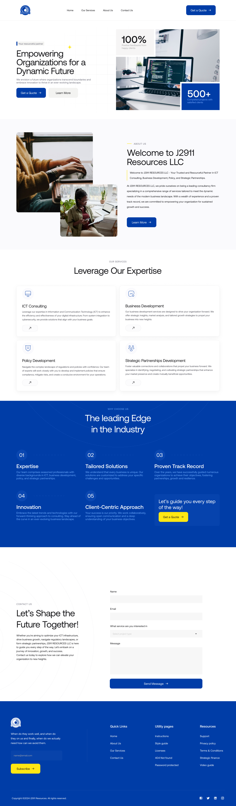

<<<<<<< HEAD
view project :     https://vocal-pudding-3a4dd0.netlify.app
=======
>>>>>>> 5fbfa5f (first)
**J2911 Resources LLC**
Welcome to J2911 Resources LLC GitHub repository!

Overview
This repository contains the source code for J2911 Resources LLC website, showcasing our services and expertise in ICT Consulting, Business Development, Policy, and Strategic Partnerships.

Features
About Us: Learn about J2911 Resources LLC, our mission, and our commitment to delivering high-quality consultancy services.
Services: Explore the services we offer, including ICT Consulting, Business Development, Policy Development, and Strategic Partnerships Development.
Contact Us: Connect with us to discuss how we can assist your organization in achieving its goals.
Technologies Used
React.js
Bootstrap
FontAwesome
React Icons
Getting Started
To get a local copy up and running follow these simple example steps:

Clone the repository: git clone https://github.com/your-username/repository-name.git
Install dependencies: npm install
Start the development server: npm start
Contributing
Contributions are welcome! If you'd like to contribute, please fork the repository and create a pull request. For major changes, please open an issue first to discuss what you would like to change.

License
This project is licensed under the MIT License - see the LICENSE file for details.

